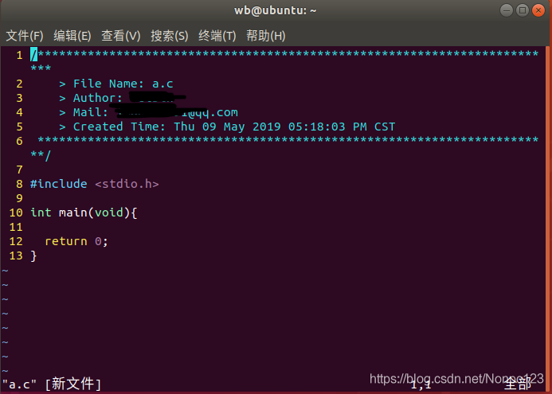
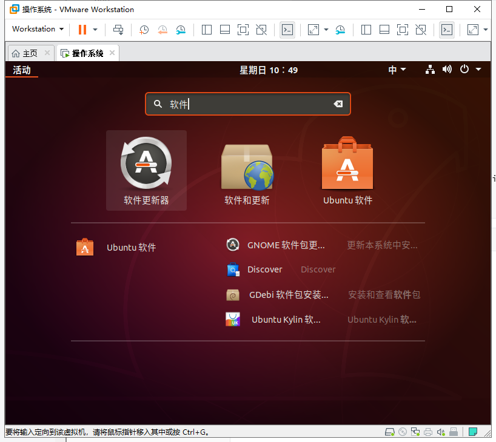
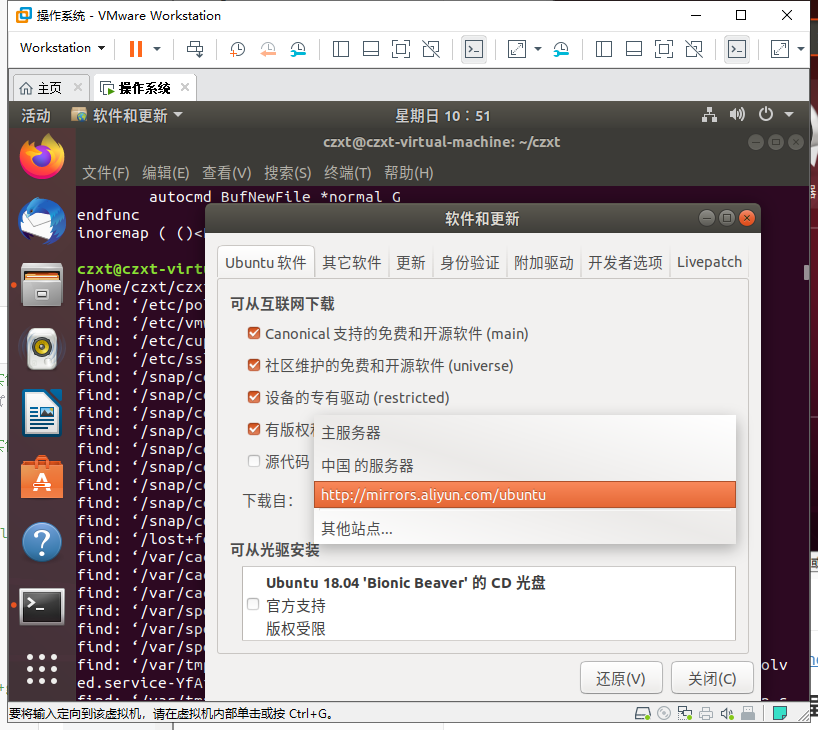
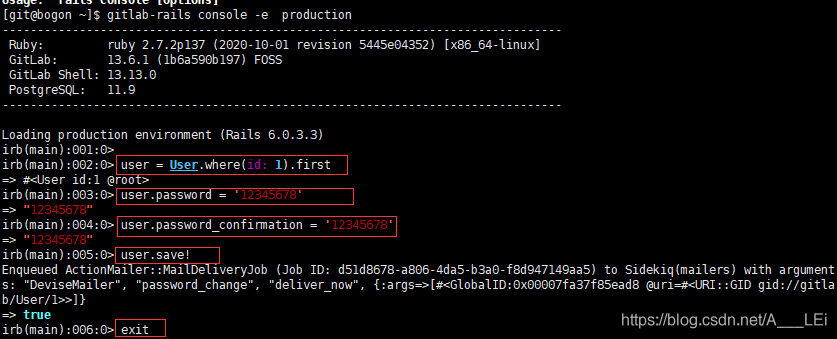

# VMware及Ubuntu的安装

### VMware使用版本15.5https://pan.baidu.com/s/1kP-gioCuPAhI2JFXJAAkSQ 提取码:647d

### ==不要装15.0版本。15.0版本很卡，还会出现开机概率性黑屏的情况==

### VMwar中安装Ubuntu18.04步骤

参考资料：https://blog.csdn.net/qq_33287871/article/details/99212352

### VMware15虚拟机启动黑屏解决方案

1. 右键点击虚拟机->设置->显示器->加速3D图形(把他的勾勾打掉)
2. 关掉所有VM开头的进程，cmd按管理员身份运行，输入netsh winsock reset，重启计算机
参考资料：https://blog.csdn.net/qq_30836399/article/details/104548273

### VMware Tools（建议安装）

VMware Tools是一套可以提高虚拟机客户机操作系统性能并改善虚拟机管理的实用dao工具。功能包括
1. 支持shuAero的操作系统上大大提升的图形性能和WindowsAero体验
2. 使虚拟机中的应用程序像其他任何应用程序窗口一样显示在主机桌面上的Unity功能
3. 主机与客户机文件系统之间的共享文件夹
4. 在虚拟机与主机或客户端桌面之间复制并粘贴文本. 图形和文件
5. 改进的鼠标性能
6. 虚拟机中的时钟与主机或客户端桌面上的时钟同步
7. 帮助自动执行客户机操作系统操作的脚本
8. 启用虚拟机的客户机自定义。
参考资料：https://zhidao.baidu.com/question/93518587.html

安装vmware tool时提示：客户机操作系统己将 CD-ROM 门锁定，并且可能正在使用 CD-ROM……

安装步骤：

参考资料：https://blog.csdn.net/weixin_37987487/article/details/81271592

# 实验环境的安装

### Ubuntu 18.4 安装vim,gcc以及gdb

在windows下安装软件，我们只需要有EXE文件，然后双击，下一步直接OK就可以了。但在LINUX下，不是这样的。每个LINUX的发行版，比如UBUNTU，都会维护一个自己的软件仓库，我们常用的几乎所有软件都在这里面。这里面的软件绝对安全，而且绝对的能正常安装。
在UBUNTU下，我们维护一个源列表，源列表里面都是一些网址信息，这每一条网址就是一个源，这个地址指向的数据标识着这台源服务器上有哪些软件可以安装使用

#### 安装VIM

``sudo apt-get install vim``

#### 配置vim

1. 在主目录下新建.vimrc , 并添加以下内容

   ```tex
   """"""""""""""""""""""""""""""""""""""""""""""""""""""""""""""""""""""""""""""""""""""""""
   " 显示相关  
   " """"""""""""""""""""""""""""""""""""""""""""""""""""""""""""""""""""""""""""""""""""""""""
    "set shortmess=atI   " 启动的时候不显示那个援助乌干达儿童的提示  
    "winpos 5 5          " 设定窗口位置  
    "set lines=40 columns=155    " 设定窗口大小  
    "set nu              " 显示行号  
    set go=             " 不要图形按钮  
    "color asmanian2     " 设置背景主题  
    "set guifont=Courier_New:h10:cANSI   " 设置字体  
    "syntax on           " 语法高亮  
    autocmd InsertLeave * se nocul  " 用浅色高亮当前行  
    autocmd InsertEnter * se cul    " 用浅色高亮当前行  
    "set ruler           " 显示标尺  
    set showcmd         " 输入的命令显示出来，看的清楚些  
    "set cmdheight=1     " 命令行（在状态行下）的高度，设置为1  
    "set whichwrap+=<,>,h,l   " 允许backspace和光标键跨越行边界(不建议)  
    "set scrolloff=3     " 光标移动到buffer的顶部和底部时保持3行距离  
    set novisualbell    " 不要闪烁(不明白)  
    set statusline=%F%m%r%h%w\ [FORMAT=%{&ff}]\ [TYPE=%Y]\ [POS=%l,%v][%p%%]\ %{strftime(\"%d/%m/%y\ -\ %H:%M\")}   "状态行显示的内容  
    set laststatus=1    " 启动显示状态行(1),总是显示状态行(2)  
    " set foldenable      " 允许折叠  
    set foldmethod=manual   " 手动折叠  
    "set background=dark "背景使用黑色 
    set nocompatible  "去掉讨厌的有关vi一致性模式，避免以前版本的一些bug和局限  
    " 显示中文帮助
    if version >= 603
    set helplang=cn
    set encoding=utf-8
    endif
            " 设置配色方案
            "colorscheme murphy
            "字体 
            "if (has("gui_running")) 
            "   set guifont=Bitstream\ Vera\ Sans\ Mono\ 10 
            "endif "
   set fencs=utf-8,ucs-bom,shift-jis,gb18030,gbk,gb2312,cp936
   set termencoding=utf-8
   set encoding=utf-8
   set fileencodings=ucs-bom,utf-8,cp936
   set fileencoding=utf-8
   autocmd BufReadPost *
       \ if line("'\"") > 0 && line("'\"") <= line("$") |
       \     exe "normal g'\"" |
       \ endif
    
   " SHORTCUT SETTINGS: {{{1
   " Set mapleader
   let mapleader=","
   " Space to command mode.
   nnoremap <space> :
   vnoremap <space> :
   " Switching between buffers.
   nnoremap <C-h> <C-W>h
   nnoremap <C-j> <C-W>j
   nnoremap <C-k> <C-W>k
   nnoremap <C-l> <C-W>l
   inoremap <C-h> <Esc><C-W>h
   inoremap <C-j> <Esc><C-W>j
   inoremap <C-k> <Esc><C-W>k
   inoremap <C-l> <Esc><C-W>l
   " "cd" to change to open directory.
   let OpenDir=system("pwd")
   nmap <silent> <leader>cd :exe 'cd ' . OpenDir<cr>:pwd<cr>
   " PLUGIN SETTINGS: {{{1
   " taglist.vim
   let g:Tlist_Auto_Update=1
   let g:Tlist_Process_File_Always=1
   let g:Tlist_Exit_OnlyWindow=1
   let g:Tlist_Show_One_File=1
   let g:Tlist_WinWidth=25
   let g:Tlist_Enable_Fold_Column=0
   let g:Tlist_Auto_Highlight_Tag=1
   " NERDTree.vim
   let g:NERDTreeWinPos="right"
   let g:NERDTreeWinSize=25
   let g:NERDTreeShowLineNumbers=1
   let g:NERDTreeQuitOnOpen=1
   " cscope.vim
   if has("cscope")
       set csto=1
       set cst
       set nocsverb
       if filereadable("cscope.out")
           cs add cscope.out
       endif
       set csverb
   endif
   " OmniCppComplete.vim
   let g:OmniCpp_DefaultNamespaces=["std"]
   let g:OmniCpp_MayCompleteScope=1
   let g:OmniCpp_SelectFirstItem=2
   " VimGDB.vim
   if has("gdb")
   	set asm=0
   	let g:vimgdb_debug_file=""
   	run macros/gdb_mappings.vim
   endif
   " LookupFile setting
   let g:LookupFile_TagExpr='"./tags.filename"'
   let g:LookupFile_MinPatLength=2
   let g:LookupFile_PreserveLastPattern=0
   let g:LookupFile_PreservePatternHistory=1
   let g:LookupFile_AlwaysAcceptFirst=1
   let g:LookupFile_AllowNewFiles=0
   " Man.vim
   source $VIMRUNTIME/ftplugin/man.vim
   " snipMate
   let g:snips_author="Du Jianfeng"
   let g:snips_email="cmdxiaoha@163.com"
   let g:snips_copyright="SicMicro, Inc"
   " plugin shortcuts
   function! RunShell(Msg, Shell)
   	echo a:Msg . '...'
   	call system(a:Shell)
   	echon 'done'
   endfunction
   nmap  <F2> :TlistToggle<cr>
   nmap  <F3> :NERDTreeToggle<cr>
   nmap  <F4> :MRU<cr>
   nmap  <F5> <Plug>LookupFile<cr>
   nmap  <F6> :vimgrep /<C-R>=expand("<cword>")<cr>/ **/*.c **/*.h<cr><C-o>:cw<cr>
   nmap  <F9> :call RunShell("Generate tags", "ctags -R --c++-kinds=+p --fields=+iaS --extra=+q .")<cr>
   nmap <F10> :call HLUDSync()<cr>
   nmap <F11> :call RunShell("Generate filename tags", "~/.vim/shell/genfiletags.sh")<cr>
   nmap <F12> :call RunShell("Generate cscope", "cscope -Rb")<cr>:cs add cscope.out<cr>
   nmap <leader>sa :cs add cscope.out<cr>
   nmap <leader>ss :cs find s <C-R>=expand("<cword>")<cr><cr>
   nmap <leader>sg :cs find g <C-R>=expand("<cword>")<cr><cr>
   nmap <leader>sc :cs find c <C-R>=expand("<cword>")<cr><cr>
   nmap <leader>st :cs find t <C-R>=expand("<cword>")<cr><cr>
   nmap <leader>se :cs find e <C-R>=expand("<cword>")<cr><cr>
   nmap <leader>sf :cs find f <C-R>=expand("<cfile>")<cr><cr>
   nmap <leader>si :cs find i <C-R>=expand("<cfile>")<cr><cr>
   nmap <leader>sd :cs find d <C-R>=expand("<cword>")<cr><cr>
   nmap <leader>zz <C-w>o
   nmap <leader>gs :GetScripts<cr>
   autocmd BufNewFile *.cpp,*.[ch],*.sh,*.java exec ":call SetTitle()"
   func SetTitle()
   	if &filetype == 'sh'
   		call setline(1,"\#########################################################################")
   		call append(line("."), "\# File Name: ".expand("%"))
   		call append(line(".")+1, "\# Author: 你的名字")
   		call append(line(".")+2, "\# mail: 你的qq号@qq.com")
   		call append(line(".")+3, "\# Created Time:".strftime("%c"))
   		call append(line(".")+4,"\#########################################################################")
   		call append(line(".")+5, "\#!/bin/bash")
   		call append(line(".")+6, "") 
   	else
   		call setline(1, "/*************************************************************************")
   		call append(line("."), "    > File Name: ".expand("%"))
   		call append(line(".")+1, "    > Author: 你的名字")
   		call append(line(".")+2, "    > Mail: 你的QQ号@qq.com ")
   		call append(line(".")+3, "    > Created Time: ".strftime("%c"))
   		call append(line(".")+4," ************************************************************************/")
   		call append(line(".")+5, "") 
   	endif
   	if &filetype == 'cpp'
   		call append(line(".")+6, "#include <iostream>")
    
   		call append(line(".")+7, "")
   		call append(line(".")+8, "using namespace std;")
   		call append(line(".")+9, "")
   		call append(line(".")+10, "int main(void){")
   		call append(line(".")+11, "")
   		call append(line(".")+12, "    return 0;")
   		call append(line(".")+13, "}")
   	endif
   	if &filetype == 'c'
   		call append(line(".")+6, "#include <stdio.h>")
   		call append(line(".")+7, "")
   		call append(line(".")+8, "int main(void){")
   		call append(line(".")+9, "")
   		call append(line(".")+10,"  return 0;")
   		call append(line(".")+11, "}")
   	endif
   	autocmd BufNewFile *normal G
   endfunc
   inoremap ( ()<Esc>i>
   ```

   

2. 执行 sudo vi /etc/vim/vimrc , 并且在文件尾添加如下内容 :

   ```
   set ts=4
   set expandtab
   set autoindent
   set nu
   set nocompatible 
   set number
   set autoindent
   set smartindent
   set showmatch
   set ruler
   set incsearch
   set tabstop=4
   set shiftwidth=4
   set softtabstop=4
   set cindent
   set nobackup
   set clipboard+=unnamed
   "inoremap [ []<Esc>i
   "inoremap { {}<Esc>i
   "inoremap ( ()<Esc>i
   "inoremap ' ''<Esc>i
   "inoremap " ""<Esc>i
   ```

   3. 重启终端或电脑 , 检测是否成功

      

#### 安装GCC

添加软件源
``sudo add-apt-repository ppa:ubuntu-toolchain-r/test``
这个命令，会访问源列表里的每个网址，并读取软件列表，然后保存在本地电脑。
``sudo apt-get update``
``sudo apt-get install gcc``
``sudo apt-get install g++``

### 解决ubuntu的apt-get命令被占用

在运行ubuntu的apt-get install命令时，经常遇到如下错误：
``无法获得锁 /var/lib/dpkg/lock-frontend - open (11: 资源暂时不可用)``
``无法获取 dpkg 前端锁 (/var/lib/dpkg/lock-frontend)，是否有其他进程正占用它？``
列出使用的进程
``ps -A | grep apt``
使用kill命令杀死进程
``sudo kill -9 886``

### Ubuntu中sudo apt-get update很慢解决办法

打开软件和更新。点击下载自，选择阿里云镜像源





# gcc gdb make的使用简略版

参考资料：https://blog.csdn.net/qq_37831145/article/details/78153221

# gcc的使用

参考资料：https://blog.csdn.net/xiahouzuoxin/article/details/25481023

### gcc生成可执行文件的过程


``gcc main.c -o main``
-o 选项表示生成目标文件名为main.exe。

``gcc -E main.c -o main.i``
-E 选项表示预处理操作，预处理就是将宏定义展开，头文件展开。预处理之后的目标文件保存在main.i，这时，你可以查看main.i的预处理结果，

``gcc -S main.c -o main.s``
-S 选项表示编译操作，其结果将生成汇编文件（*.s文件，这里使用-o选项定义目标文件为main.s）。我们也可以查看分析上述Hello代码的汇编代码，

NOTES:
生成汇编文件（包含汇编代码的文件）的过程是编译，不是汇编，汇编是将汇编代码转换成目标文件*.obj的过程。 从这点上理解，汇编文件生成可执行文件的过程是没有编译操作的。

``gcc -c main.c -o main.obj``
-c 选项将源文件生成目标文件main.obj，main.obj其实已经是一种近似可执行文件了，通过链接操作链接相应的库就可以执行了。

第4步的链接直接使用``gcc main.c -o main``就可以完成

### gcc的一些其它选项

- -g 以操作系统的本地格式(stabs,COFF,XCOFF,或DWARF)产生调试信息. 只有使用了-g才能使用gdb工具进行调试

```shell
gcc -g main.c -o main 
gdb main 
```

- -Dname 宏定义某个name宏，这个宏是全局的，在控制程序上很有帮助 比如有如下main.c源程序，通过_DEBUG宏可以控制是否打印结果，

  ```c
  #include <stdio.h>
      int main(void)
      {
          int a = 2;
          int b = 3;
          int c = a + b;
  
      #ifdef _DEBUG
          printf("c=%d\n", c);
      #endif
          return 0;
      }
  ```

  

# GDB的使用

参考资料：https://blog.csdn.net/xiahouzuoxin/article/details/25481023

###  gdb调试C程序

```c
#include <stdio.h>
int add(int a, int b)
{
    int c = a + b;
    return c;
}
 
int main(void)
{
    int i = 0;
    int j = 3;
    int k = add(i,j);
    printf("i=%d, j=%d, k=%d\n", i,j,k);
    return 0;
}
```

使用gcc编译及gdb调试程序的方法如下：

```shell
gcc -g main.c -o main			### 注：编译时使用-g选项才能生成符号表用于gdb调试
```

```shell
Administrator@DADI-20131210YK /cygdrive/e/MyDesigner/Projects/notes/codes/实例学习gcc+gdb+make/gdb
$ gcc -g main.c -o main          ### 注：编译时使用-g选项才能生成符号表用于gdb调试
 
Administrator@DADI-20131210YK /cygdrive/e/MyDesigner/Projects/notes/codes/实例学习gcc+gdb+make/gdb
$ gdb main
GNU gdb (GDB) 7.3.50.20110821-cvs (cygwin-special)
Copyright (C) 2011 Free Software Foundation, Inc.
License GPLv3+: GNU GPL version 3 or later <http://gnu.org/licenses/gpl.html>
This is free software: you are free to change and redistribute it.
There is NO WARRANTY, to the extent permitted by law.  Type "show copying"
and "show warranty" for details.
This GDB was configured as "i686-cygwin".
For bug reporting instructions, please see:
<http://www.gnu.org/software/gdb/bugs/>...
Reading symbols from /cygdrive/e/MyDesigner/Projects/notes/codes/实例学习gcc+gdb+make/gdb/main...don
e.
(gdb) l main                     ### 注：list查看程序，l [函数名/行数]
16
17          return c;
18      }
19
20      int main(void)
21      {
22          int i = 0;
23          int j = 3;
24
25          int k = add(i,j);
(gdb)                            ### 注：Enter按键接上面继续查看程序
26
27          printf("i=%d, j=%d, k=%d\n", i,j,k);
28
29          return 0;
30      }
31
(gdb) b 23                       ### 注：在23行添加断点
Breakpoint 1 at 0x4010d5: file main.c, line 23.
(gdb) b add                      ### 注：在add函数入口添加断点
Breakpoint 2 at 0x401096: file main.c, line 15.
(gdb) b 29                       ### 注：在29行添加断点
Breakpoint 3 at 0x401112: file main.c, line 29.
(gdb) info break                 ### 注：查看已添加的断点信息
Num     Type           Disp Enb Address    What
1       breakpoint     keep y   0x004010d5 in main at main.c:23
2       breakpoint     keep y   0x00401096 in add at main.c:15
3       breakpoint     keep y   0x00401112 in main at main.c:29
(gdb) r                          ### 注：运行程序
Starting program: /cygdrive/e/MyDesigner/Projects/notes/codes/实例学习gcc+gdb+make/gdb/main
[New Thread 2492.0x36c]
[New Thread 2492.0x1140]
 
Breakpoint 1, main () at main.c:23
23          int j = 3;
(gdb) r                          ### 注：运行程序
$1 = 0
(gdb) n                          ### 注：next下一步（把函数当一条语句直接跳过）
25          int k = add(i,j);
(gdb) s                          ### 注：step下一步（会执行到函数内部）
 
Breakpoint 2, add (a=0, b=3) at main.c:15
15          int c = a + b;
(gdb) c                          ### 注：continue从运行到的当前位置继续往下执行，直到遇到下一个断点
Continuing.
i=0, j=3, k=3
 
Breakpoint 3, main () at main.c:29
29          return 0;
(gdb) finish                     ### 注：直接执行到当前函数的结尾处，对main函数不起作用
"finish" not meaningful in the outermost frame.
(gdb) c                          ### 注：continue继续执行
Continuing.
[Inferior 1 (process 2492) exited normally]
(gdb) q                          ### 注：程序执行结束，quit退出gdb
 
Administrator@DADI-20131210YK /cygdrive/e/MyDesigner/Projects/notes/codes/实例学习gcc+gdb+make/gdb
$
```

```shell
(gdb) l main                     ### 注：list查看程序，l [函数名/行数]
(gdb) b 23                       ### 注：在23行添加断点
(gdb) b add                      ### 注：在add函数入口添加断点
(gdb) b 29                       ### 注：在29行添加断点
(gdb) info break                 ### 注：查看已添加的断点信息
(gdb) r                          ### 注：运行程序
(gdb) n                          ### 注：next下一步（把函数当一条语句直接跳过）
(gdb) s                          ### 注：step下一步（会执行到函数内部）
(gdb) c                          ### 注：continue从运行到的当前位置继续往下执行，直到遇到下一个断点
(gdb) finish                     ### 注：直接执行到当前函数的结尾处，对main函数不起作用
(gdb) c                          ### 注：continue继续执行
(gdb) q                          ### 注：程序执行结束，quit退出gdb
```

# 使用Makefile构建工程

参考资料：https://blog.csdn.net/xiahouzuoxin/article/details/25481023

Make是构建工程的工具，Make工具对用户编写的Makefile进行解析，实现只需要一个命令就可以编译、链接整个工程。

以Example2为例:

mian.cpp

```c
#include <stdio.h>
#include "add.h"
#include "sub.h"

int main(void)
{
    int a = 2;
    int b = 3;
    int c = add(a,b);
    int d = sub(a,b);

#ifdef _DEBUG
    printf("c=%d\n", c);
    printf("d=%d\n", d);
#endif
    return 0;
}
```

add.c

```c
int add(int a,int b){
    return (a+b);
}
```

add.h

```c
#ifndef _ADD_H
#define _ADD_H

extern int add(int a, int b);

#endif
```

sub.c

```c
int sub(int a, int b)
{
    return (a-b);
}
```

sub.h

```c
#ifndef _SUB_H
#define _SUB_H

extern int sub(int a, int b);

#endif
```

Makefile文件内容为:

```makefile
main:main.o add.o sub.o                 # 目标:依赖
	gcc main.o add.o sub.o -o main      # 命令（必需以TAB开头）
 
main.o:main.c
	gcc -c -D_DEBUG main.c -o main.o
add.o:add.c
	gcc -c -D_DEBUG add.c -o add.o
sub.o:sub.c
	gcc -c -D_DEBUG sub.c -o sub.o

.PHONY:clean
clean:
	-rm main *o
```

回到命令行，使用make命令看看Makefile的效果：

```shell
make 
./main 
```

- Makefile的格式

  ```
  目标：依赖
      命令（以TAB开头）
  ```

  目标是链接后的可执行文件名；依赖是工程中的用于编译的c文件和用于连接的*.o文件的集合；就用gcc编译的工程而言，命令就是gcc命令，可以使用任意的gcc参数

- 使用make命令解析Makefile文件，解析的文件名可以是Makefile或makefile，如果是其它名称，则需要使用make -f [filename]指定文件名。强烈建议使用Makefile作为文件名（符合Linux的哲学——简洁、首字母大写容易突出文件位置）

- Makefile可以有多个目标（main.o add.o sub.o），但只能有一个最终目标（main）。Makefile文件中第一条规则中的目标将确定为最终目标。make命令默认执行最终目标，若只执行Makefile中其它目标，使用make [Target]，如要清除工程下的目标文件，使用``make clean``

- Makefile中将那些没有任何依赖只有执行动作的目标称伪目标（clean），使用.PHONY声明。伪目标不能作为最终目标。

- Makefile中使用变量：Makefile中的变量将是按字符串的方式进行替换，下面是一些系统特殊的变量。

  ```
  $^: 代表所有依赖文件
  $@：代表目标
  $<：代表依赖文件中的第一个依赖文件
  ```

  变量可以大大简化Makefile的编写复杂度，使用变量后的Makefile如下：

  ```makefile
  CC=gcc
  OBJS=main.o add.o sub.o
  CFLAGS=-D_DEBUG
   
  main:$(OBJS)
  	$(CC) $(CFLAGS) $^ -o $@
   
  main.o:main.c
  	$(CC) $(CFLAGS) -c $^ -o $@
  add.o:add.c
  	$(CC) $(CFLAGS) -c $^ -o $@
  sub.o:sub.c
  	$(CC) $(CFLAGS) -c $^ -o $@
  
  .PHONY:clean
  clean:
  	-rm main *.o
  ```

  其中CC、OBJS、CFLAGS都是自定义的Makefile变量，$^和$@是系统特殊的变量

- 上面的Makefile还是太复杂，可不可以再简单点，没问题：使用模式匹配。

  ```makefile
  CC=gcc
  OBJS=main.o add.o sub.o
  CFLAGS=-D_DEBUG
  
  main:$(OBJS)
  	$(CC) $(CFLAGS) $^ -o $@
  
  %.o:%.c
  	$(CC) $(CFLAGS) -c $^ -o $@
  
  .PHONY:clean
  clean:
  	-rm main *.o
  ```

  上面的Makefile使用%用来匹配任何非空字符串。

  1. 模式规则“%.o:%.c”，它表示的含义是：所有的.o文件依赖于对应的.c文件。
  2. 模式规则%.o:debug.h，表示所有的.o文件都依赖于头文件“debug.h”

  在编写大型程序时，常常工程中的.c都有与之对应的.h文件，以上两种用法在Makfile很常用。

# Ubuntu18.04 Gitlab安装

### 安装卡住:

内存不足导致，官方的推荐（内存最少 4G）。本人卡住之后用3G内存，2核完成了安装。（浪费了大量时间orz）

==更新：请务必4G，3G还是卡==

1. 安装并配置必要的依赖关系

   ```shell
   sudo apt-get update
   sudo apt-get install -y curl openssh-server ca-certificates
   ```

2. 接下来，安装Postfix发送通知邮件。

   ```shell
   sudo apt-get install -y postfix
   ```

   在Postfix安装期间，可能会出现一个配置屏幕。选择“Internet站点”并按回车。使用您的服务器的外部DNS作为'邮件名'并按回车。如果出现其他屏幕，请继续按回车键以接受默认值。

3. 首先信任 GitLab 的 GPG 公钥:

   ```shell
   curl https://packages.gitlab.com/gpg.key 2> /dev/null | sudo apt-key add - &>/dev/null
   ```

4. ```shell
   sudo vim /etc/apt/sources.list.d/gitlab-ce.list
   ```

5. 输入以下内容

   ```
   deb https://mirrors.tuna.tsinghua.edu.cn/gitlab-ce/ubuntu xenial main
   ```

   ### 注意：修改sources.list之后需要执行命令`sudo apt-get update`

6. 接下来，安装GitLab软件包。将`http：// gitlab.steven.com`更改为您想要访问您的GitLab实例的URL。安装将自动在该URL处配置并启动GitLab。安装后HTTPS需要额外的配置。

   ```shell
   sudo EXTERNAL_URL="http://gitlab.steven.com" apt-get install gitlab-ce
   ```

7. 修改外部url

   在gitlab配置文件/etc/gitlab/gitlab.rb中修改外部url，改为自己的ip地址或者域名

   ```
   external_url 'http://172.16.129.170'  ## 本机的局域网ip地址为172.16.129.170
   ```

8.  重新配置gitlab

   ```shell
   gitlab-ctl reconfigure  ## 此过程可能需要较长时间
   ```

9. 重启gitlab

   ```shell
   gitlab-ctl restart
   ```

   

参考资料：

- [详解Ubuntu的source.list文件](https://blog.csdn.net/u012843189/article/details/80964287)
- https://www.cnblogs.com/xiaojf/p/11113363.html
- [Gitlab Community Edition 镜像使用帮助](https://mirror.tuna.tsinghua.edu.cn/help/gitlab-ce/)

### 重置管理员密码

1. 进入 GitLab 控制台

   ```shell
   gitlab-rails console -e production
   ```

   GitLab 版本不同，命令会有所不同（网上说的而基本都是`gitlab-rails console production` ），推荐大家直接上 GitLab 官网去找对应版本的命令
   我测是使用`gitlab-rails console production`是进不去GitLab 控制台的

2. 执行命令： `user = User.where(id: 1).first`，此 user 则表示 root 用户

3. 修改密码

   执行命令：`user.password = 'secret_pass'`修改密码， `user.password_confirmation = 'secret_pass'` 确认密码

4. 保存密码

   执行命令： `user.save!`

5. 退出控制台

   执行命令： `exit`

完整过程如下：



参考资料：[GitLab → 搭建中常遇的问题与日常维护](https://blog.csdn.net/A___LEi/article/details/110476531)

### Gitlab服务命令：

启动所有 gitlab 组件；

```shell
sudo gitlab-ctl start
```

停止所有 gitlab 组件；

```shell
sudo gitlab-ctl stop
```

重启所有 gitlab 组件；

```shell
sudo gitlab-ctl restart
```

查看服务状态；

```shell
sudo gitlab-ctl status
```

启动服务(再次加载配置)；

```shell
sudo gitlab-ctl reconfigure
```

修改默认的配置文件；

```shell
sudo vim /etc/gitlab/gitlab.rb
```

检查gitlab；

```shell
gitlab-rake gitlab:check SANITIZE=true --trace
```

查看日志；

```shell
sudo gitlab-ctl tail
```

# pintos安装

参考资料：https://www.youtube.com/watch?v=CI5FHJhXv38&ab_channel=Nh%E1%BA%ADtL%C3%AADuy

视频在youtube上，科学上网

1. 安装qemu

   ```shell
   sudo apt-get install qemu
   ```

2. 下载并解压pintos

   ```shell
   tar -xzvf pintos.tar.gz
   ```

   

3. 修改pintos/src/utils/pintos-gdb中的GDBMACROS为``/home/....../pintos-anon-master/src/misc/gdb-macros``如下图所示


4. 修改pintos-anon-master/src/utils/Makefile中的``LDFLAGS``为``LDLIBS``

   

5. 重新编译utils文件夹

   ```shell
   cd pintos-anon-master/src/utils
   make
   ```

6. pintos/src/threads/Make.vars中修改``SIMULATOR = --qemu``

   

7. 编译threads目录

   ```shell
   cd pintos-anon-master/src/threads
   make
   ```

8. 修改pintos-anon-master/src/utils/pintos文件

   第103（附近）修改``bochs``为``qemu``

   

   修改第259行（附近）``kernel.bin``为``/home/....../pintos-anon-master/src/threads/build/kernel.bin``

   

   修改第623行（附近）``qemu``为``qemu-system-86_64``

   

9. 修改pintos-anon-master/src/utils/Pintos.pm第362行``loader.bin``为``/home/.../pintos-anon-master/src/threads/build/loader.bin``

10. 将pintos-anon-master/src/utils加如环境变量

    打开 ~/.bashrc，在末尾添加``export PATH=/home/../pintos-anon-master/src/utils:$PATH``

    

11. 重新加载环境变量

    ```shell
    source ~/.bashrc
    ```

12. 运行pintos

    ```shell
    pintos run alarm-mutiple
    ```

    出现如下结果：

    

13. 


# 附：Linux使用命令

Linux find过滤掉没有查看权限的文件

```shell
find . -name "xxx" 2> /dev/null
```

移动文件

```shell
mv file1 dir1
```

vim查找单词

命令模式下，输入/user

/要搜索的字符串或者字符

按下回车之后，可以看到vim已经把光标移动到该字符处和高亮了匹配的字符串

查看下一个匹配按下n(小写n)

跳转到上一个匹配按下N（大写N）

打开别的文件，发现也被高亮了，输入``nohlsearch``或``noh``或``set noh``

